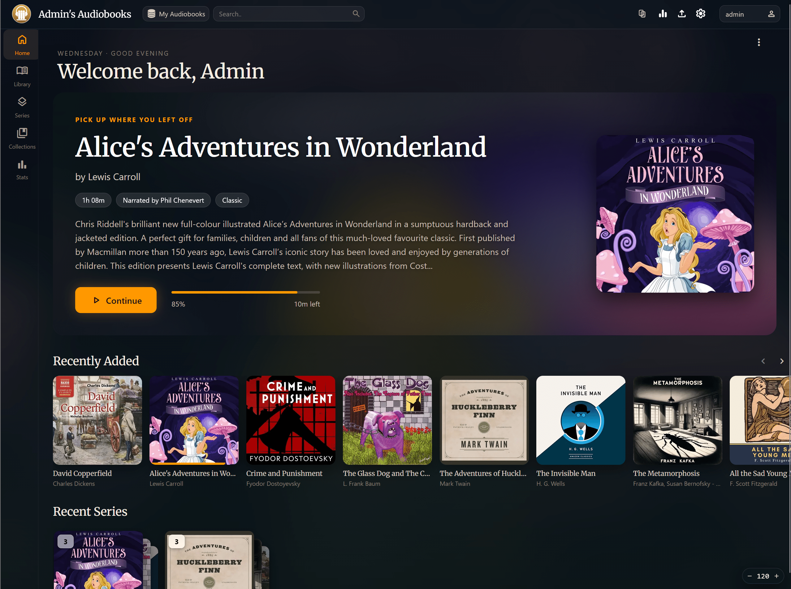
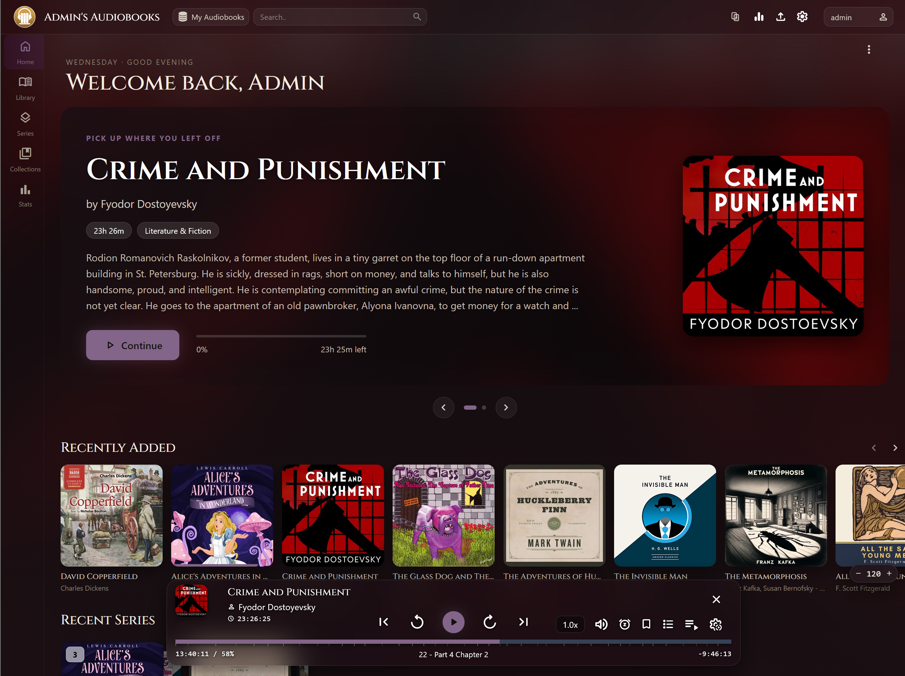

# NanoHive ABS Theme

A drop-in reverse proxy that applies the NanoHive theme to **Audiobookshelf Web** for every
user, with no Tampermonkey and no per-browser setup. Put it in front of your ABS server; it
injects the theme's CSS and JS into the HTML it serves.

Nothing is written to your ABS container. Remove the proxy and you're back to stock.

Web only. The ABS mobile apps render natively and are unaffected — they'll keep working
through the proxy, they just won't be themed.

| Home | Book details |
|---|---|
|  |  |
|  |  |


## What it changes

- A warm, cinematic dark palette with 12 base themes and a configurable accent colour
- A hero carousel on the home page for your in-progress books
- Redesigned book detail page: HD cover, blurred cinematic background, restructured metadata
- A real mobile layout: drawer navigation, touch-friendly appbar, no horizontal overflow
- An in-app settings panel (gear icon) where **each user** picks their own theme, font,
  accent, and which shelves and sidebar entries to show
- A custom logo you can **upload from the settings panel** and have the server host itself,
  so it still loads when your server has no internet access
- **Server-wide defaults saved from the UI** (admins): one click stores your current look
  as the default for every user — no compose editing, survives updates via a small volume
- An expanded "Recent Series" shelf (ABS's native one is capped at 5 items), with an
  optional stock-ABS series look if you prefer it
- An extended ereader: your theme colours by default, a typeface picker with curated
  serif / sans-serif / dyslexia-friendly (OpenDyslexic) fonts, floating player fixes
- Ebooks in progress can join the hero carousel (default), stay a separate shelf, or be
  hidden — per-user choice in the customization panel
- Covers follow your library's aspect setting everywhere, including the details page
- Panel and carousel fully translated into all 40 languages ABS ships


## Run it

```bash
docker run -d \
  -p 8080:80 \
  -v nh_theme_data:/data/nh \
  -e ABS_UPSTREAM=http://your-abs-host:80 \
  ghcr.io/rodzalendo/nanohive-abs-theme:latest
```

Point your browser (or reverse proxy / Cloudflare tunnel) at port 8080 instead of ABS
directly. See `docker-compose.example.yml` for a compose setup.

Already serving ABS on the port your users know? Move ABS to another port and publish the
theme container on the old one, so existing bookmarks keep working.

Sitting the theme behind your own TLS-terminating reverse proxy (nginx, NPM, Traefik,
Cloudflare tunnel) is fully supported, including OIDC login — the proxy forwards the
incoming `X-Forwarded-Proto` untouched (requires v1.8.0+).

### TrueNAS SCALE

Keep the Audiobookshelf app exactly as it is and add the theme as a second app beside it.
On SCALE 24.10 ("Electric Eel") or later: **Apps → Discover → Custom App → Install via
YAML** and paste:

```yaml
services:
  abs-theme:
    image: ghcr.io/rodzalendo/nanohive-abs-theme:latest
    restart: unless-stopped
    ports:
      - "30081:80"          # any free port; open http://<truenas-ip>:30081
    environment:
      ABS_UPSTREAM: "http://<truenas-ip>:30013"   # your ABS app's web port
    volumes:
      - /mnt/tank/apps/nanohive:/data/nh          # any dataset path; persists server defaults + uploaded logo
```

On older (k3s-based) SCALE releases, use the **Custom App** form instead and fill in the
same three things: the image, the `ABS_UPSTREAM` env var, the port mapping, plus host-path
storage for `/data/nh`.

TrueNAS-specific notes:

- `ABS_UPSTREAM` must be the **TrueNAS host IP plus the ABS app's published port** — not
  `localhost` (that is the theme container itself) and not the ABS container name (catalog
  apps live on auto-generated `ix-…` networks the custom app cannot see).
- The theme writes nothing to ABS. Deleting the theme app returns everything to stock.
- If a reverse proxy fronts your NAS, point it at the theme's port instead of ABS's.
- The ABS mobile apps can keep using the raw ABS port; the theme only affects browsers.

## Configuration

Only `ABS_UPSTREAM` is required. The `NH_*` variables set the **defaults a user sees on
their first visit**; anyone can then override them for themselves in the settings panel.

Precedence: **a user's saved settings** beat **UI-saved server defaults** beat **your env
vars** beat the built-in defaults.

| Variable | Default | Notes |
|---|---|---|
| `ABS_UPSTREAM` | *(required)* | Where ABS actually listens, e.g. `http://audiobookshelf:80` |
| `NH_APP_NAME` | *(empty)* | Replaces "audiobookshelf" in the appbar. No `"` or `\` |
| `NH_SHOW_LOGO_TEXT` | `true` | Show the app name beside the logo. `true`/`false` only |
| `NH_LOGO_URL` | *(empty)* | Custom logo. An external URL, or `/_nh/logo.<ext>` for a logo hosted by the server itself (works offline — see below). No `"` or `\` |
| `NH_COLORIZE_LOGO` | `false` | Tint the logo with the accent colour. `true`/`false` only |
| `NH_ACCENT_COLOR` | `#e0c27a` | Any hex colour |
| `NH_BASE_THEME` | `warm` | `warm` `slate` `black` `navy` `mocha` `pine` `plum` `crimson` `ocean` `sand` `steel` `wine` |
| `NH_MAIN_FONT` | `Merriweather` | Any Google Font offered in the settings panel |
| `NH_FONT_SCALE` | `1.0` | Global text scale |
| `NH_CAROUSEL_TIMING` | `15` | Seconds per hero slide; `0` disables auto-advance |
| `NH_SHOW_RECENT_SERIES` | `true` | The expanded Recent Series shelf. `true`/`false` only |
| `NH_RECENT_SERIES_COUNT` | `12` | Series shown in that shelf |
| `NH_CUSTOM_SERIES_CARDS` | `true` | Stacked series covers; `false` = stock ABS series cards (keeps font + count badge) |
| `NH_SHOW_HERO_CAROUSEL` | `true` | The home hero carousel. `true`/`false` only |
| `NH_FOUC_BG` | `#181512` | Background painted before the theme loads. Match your base theme's canvas |
| `THEME_VERSION` | *(build stamp)* | Informational; printed at startup |

The container refuses to start on a malformed value (a non-boolean where a boolean is
required, or a quote in `NH_APP_NAME`) rather than serving a half-broken page.

### Server defaults from the UI (recommended)

Admins get a **Server Defaults** card at the bottom of Settings → Theme. *Save* stores your
current settings on the proxy as the default for every user; *Clear* removes them (and
resets your own browser). Writes are admin-only: the proxy replays your ABS login token
against an admin-only ABS endpoint before accepting the request.

The file lives at `/data/nh/server-config.json` inside the container — **mount a volume
there** (see the run command above) or it resets when the container is recreated.

### Custom logo (incl. offline / air-gapped)

You can point `NH_LOGO_URL` (or the **Custom Logo** field in the settings panel) at an
external image URL. For a server with **no internet access**, host the logo on the proxy
itself instead:

- **Easiest:** in Settings → Theme → *Branding & Style*, click **"Upload from device…"**
  (admins only), pick an image, and it's uploaded and applied in one click.
- **Manual:** drop an image into the `/data/nh` volume as `logo.png` (or `.svg`, `.jpg`,
  `.webp`, …) and set the logo to `/_nh/logo.png`.

Either way the logo is served same-origin from the volume, so it loads with no outbound
request. It persists across updates as long as the `/data/nh` volume is mounted.

### Where settings live

There are three layers, and they never touch your Audiobookshelf database.

**Your defaults** are the `NH_*` environment variables. nginx reads them at container start
and injects them into every page as a `window.NH_CONFIG` object. Change one, restart the
container, and every user who hasn't customised that particular option sees the new value.

**UI-saved server defaults** sit above the env vars: the Server Defaults card writes them
to the proxy's `/data/nh` volume and nginx injects them into every page before first paint.

**Each user's overrides** are written to their browser's `localStorage` under the key
`nh-settings`, as JSON, the moment they change something in the settings panel. This is
per-browser and per-device: the same person gets your defaults again on a new phone until
they customise it there too. Nothing is sent to the server, so users on shared or read-only
accounts can still theme their own view, and clearing site data resets them to your defaults.

Any option a user has never touched isn't stored at all, so later changes to your `NH_*`
defaults still reach them. Only the specific keys they changed are pinned to their browser.

To reset yourself to the server defaults, clear the site's data, or run this in the browser
console and reload:

```js
localStorage.removeItem('nh-settings'); location.reload();
```

### Canvas colours for `NH_FOUC_BG`

`warm` `#181512` · `slate` `#111625` · `black` `#080808` · `navy` `#0a111a` ·
`mocha` `#231c18` · `pine` `#121a15` · `plum` `#1a1320` · `crimson` `#1d1212` ·
`ocean` `#0b1618` · `sand` `#1c1814` · `steel` `#13171c` · `wine` `#1a1014`

## How it works

nginx proxies everything to ABS untouched, then rewrites the HTML on the way out:

1. `window.NH_CONFIG` is injected into `<head>`, carrying the env-var defaults above.
2. `core.js` and `nh-early.js` are **inlined** into `<head>` via SSI. `core.js` patches
   `fetch`/`XHR` before the ABS bundle boots; `nh-early.js` applies the resolved theme
   before first paint, so the page never flashes the stock palette.
3. `enhancements.js` and `book-details.js` are inlined before `</body>`.

Because the scripts are inlined rather than linked, browsers never cache them separately —
rebuild the image and the next page load is already running the new code.

Upstream compression is disabled so `sub_filter` can rewrite the HTML, and WebSocket
upgrades are passed through for ABS's Socket.IO progress sync.

## Caveat: it tracks ABS releases

The theme targets ABS's current DOM. When Audiobookshelf ships a UI change, some selectors
may break until the theme files are updated. Tested against Audiobookshelf 2.x. Open an
issue with your ABS version if something looks wrong.

Not affiliated with the Audiobookshelf project.

## Updating the theme

Edit the files in `theme/` and rebuild. Nothing to cache-bust.

## Build

```bash
docker build -t nanohive-abs-theme .

# multi-arch (amd64 + arm64 for Pi/NAS):
docker buildx build --platform linux/amd64,linux/arm64 \
  -t ghcr.io/rodzalendo/nanohive-abs-theme:latest --push .
```

## License

MIT. See [LICENSE](LICENSE).
