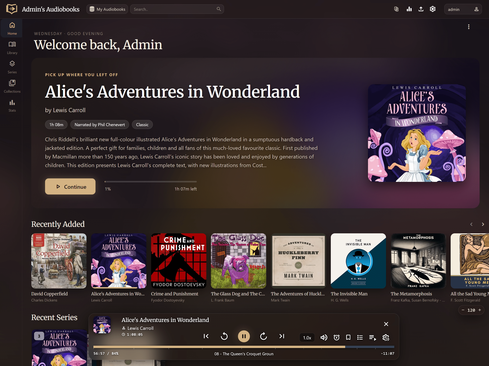
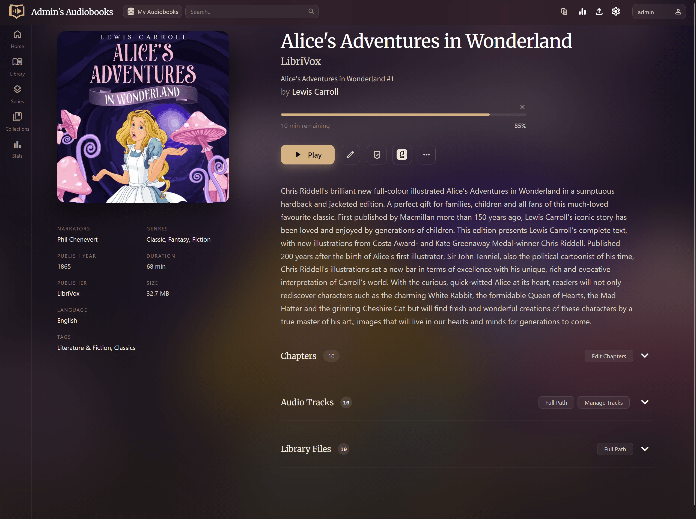
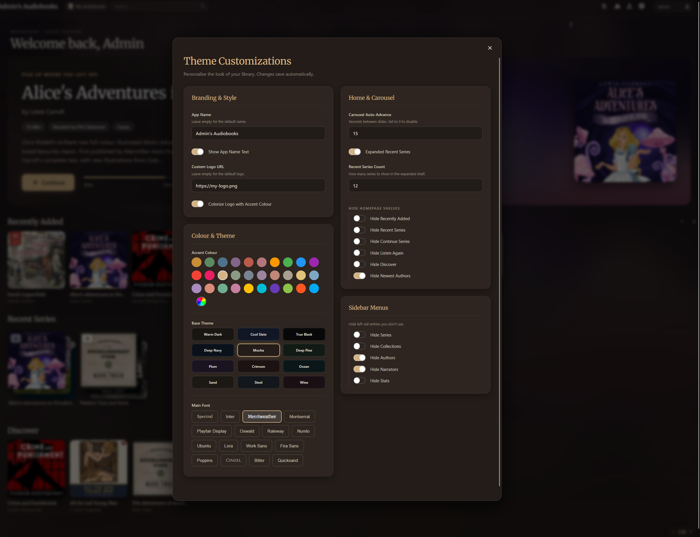

# NanoHive ABS Theme

A drop-in reverse proxy that applies the NanoHive theme to **Audiobookshelf Web** for every
user, with no Tampermonkey and no per-browser setup. Put it in front of your ABS server; it
injects the theme's CSS and JS into the HTML it serves.

Nothing is written to your ABS container. Remove the proxy and you're back to stock.

Web only. The ABS mobile apps render natively and are unaffected — they'll keep working
through the proxy, they just won't be themed.

| Home | Book details |
|---|---|
|  |  |



## What it changes

- A warm, cinematic dark palette with 12 base themes and a configurable accent colour
- A hero carousel on the home page for your in-progress books
- Redesigned book detail page: HD cover, blurred cinematic background, restructured metadata
- A real mobile layout: drawer navigation, touch-friendly appbar, no horizontal overflow
- An in-app settings panel (gear icon) where **each user** picks their own theme, font,
  accent, and which shelves and sidebar entries to show
- An expanded "Recent Series" shelf (ABS's native one is capped at 5 items)


## Run it

```bash
docker run -d \
  -p 8080:80 \
  -e ABS_UPSTREAM=http://your-abs-host:80 \
  ghcr.io/rodzalendo/nanohive-abs-theme:latest
```

Point your browser (or reverse proxy / Cloudflare tunnel) at port 8080 instead of ABS
directly. See `docker-compose.example.yml` for a compose setup.

Already serving ABS on the port your users know? Move ABS to another port and publish the
theme container on the old one, so existing bookmarks keep working.

## Configuration

Only `ABS_UPSTREAM` is required. The `NH_*` variables set the **defaults a user sees on
their first visit**; anyone can then override them for themselves in the settings panel.

Precedence: **a user's saved settings** beat **your env vars** beat the built-in defaults.

| Variable | Default | Notes |
|---|---|---|
| `ABS_UPSTREAM` | *(required)* | Where ABS actually listens, e.g. `http://audiobookshelf:80` |
| `NH_APP_NAME` | *(empty)* | Replaces "audiobookshelf" in the appbar. No `"` or `\` |
| `NH_SHOW_LOGO_TEXT` | `true` | Show the app name beside the logo. `true`/`false` only |
| `NH_LOGO_URL` | *(empty)* | Custom logo image URL. No `"` or `\` |
| `NH_COLORIZE_LOGO` | `false` | Tint the logo with the accent colour. `true`/`false` only |
| `NH_ACCENT_COLOR` | `#e0c27a` | Any hex colour |
| `NH_BASE_THEME` | `warm` | `warm` `slate` `black` `navy` `mocha` `pine` `plum` `crimson` `ocean` `sand` `steel` `wine` |
| `NH_MAIN_FONT` | `Merriweather` | Any Google Font offered in the settings panel |
| `NH_FONT_SCALE` | `1.0` | Global text scale |
| `NH_CAROUSEL_TIMING` | `15` | Seconds per hero slide; `0` disables auto-advance |
| `NH_SHOW_RECENT_SERIES` | `true` | The expanded Recent Series shelf. `true`/`false` only |
| `NH_RECENT_SERIES_COUNT` | `12` | Series shown in that shelf |
| `NH_FOUC_BG` | `#181512` | Background painted before the theme loads. Match your base theme's canvas |
| `THEME_VERSION` | *(build stamp)* | Informational; printed at startup |

The container refuses to start on a malformed value (a non-boolean where a boolean is
required, or a quote in `NH_APP_NAME`) rather than serving a half-broken page.

### Where settings live

There are two layers, and they never touch your Audiobookshelf database.

**Your defaults** are the `NH_*` environment variables. nginx reads them at container start
and injects them into every page as a `window.NH_CONFIG` object. Change one, restart the
container, and every user who hasn't customised that particular option sees the new value.

**Each user's overrides** are written to their browser's `localStorage` under the key
`nh-settings`, as JSON, the moment they change something in the settings panel. This is
per-browser and per-device: the same person gets your defaults again on a new phone until
they customise it there too. Nothing is sent to the server, so users on shared or read-only
accounts can still theme their own view, and clearing site data resets them to your defaults.

Any option a user has never touched isn't stored at all, so later changes to your `NH_*`
defaults still reach them. Only the specific keys they changed are pinned to their browser.

To reset yourself to the server defaults, clear the site's data, or run this in the browser
console and reload:

```js
localStorage.removeItem('nh-settings'); location.reload();
```

### Canvas colours for `NH_FOUC_BG`

`warm` `#181512` · `slate` `#111625` · `black` `#080808` · `navy` `#0a111a` ·
`mocha` `#231c18` · `pine` `#121a15` · `plum` `#1a1320` · `crimson` `#1d1212` ·
`ocean` `#0b1618` · `sand` `#1c1814` · `steel` `#13171c` · `wine` `#1a1014`

## How it works

nginx proxies everything to ABS untouched, then rewrites the HTML on the way out:

1. `window.NH_CONFIG` is injected into `<head>`, carrying the env-var defaults above.
2. `core.js` and `nh-early.js` are **inlined** into `<head>` via SSI. `core.js` patches
   `fetch`/`XHR` before the ABS bundle boots; `nh-early.js` applies the resolved theme
   before first paint, so the page never flashes the stock palette.
3. `enhancements.js` and `book-details.js` are inlined before `</body>`.

Because the scripts are inlined rather than linked, browsers never cache them separately —
rebuild the image and the next page load is already running the new code.

Upstream compression is disabled so `sub_filter` can rewrite the HTML, and WebSocket
upgrades are passed through for ABS's Socket.IO progress sync.

## Caveat: it tracks ABS releases

The theme targets ABS's current DOM. When Audiobookshelf ships a UI change, some selectors
may break until the theme files are updated. Tested against Audiobookshelf 2.x. Open an
issue with your ABS version if something looks wrong.

Not affiliated with the Audiobookshelf project.

## Updating the theme

Edit the files in `theme/` and rebuild. Nothing to cache-bust.

## Build

```bash
docker build -t nanohive-abs-theme .

# multi-arch (amd64 + arm64 for Pi/NAS):
docker buildx build --platform linux/amd64,linux/arm64 \
  -t ghcr.io/rodzalendo/nanohive-abs-theme:latest --push .
```

## License

MIT. See [LICENSE](LICENSE).
